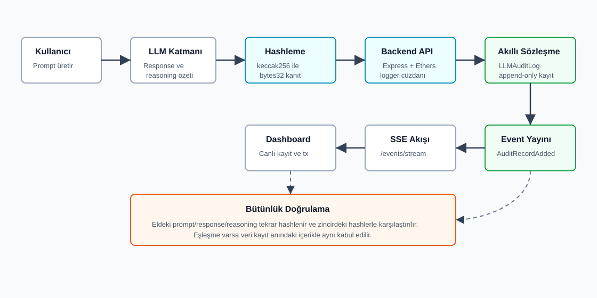
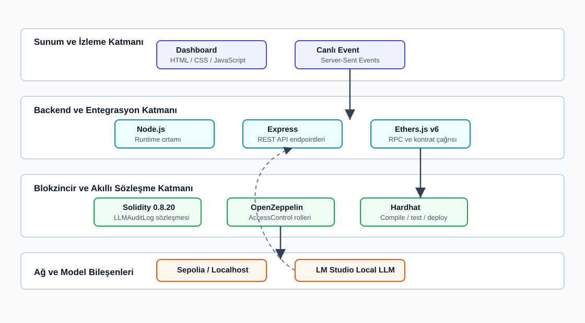

# Burdur Mehmet Akif Ersoy Üniversitesi

## Mühendislik-Mimarlık Fakültesi

## Bilgisayar Mühendisliği Bölümü

### Bilgi Güvenliğine Giriş Dersi Final Proje Raporu

**Proje Başlığı:** Blokzincir Tabanlı Değiştirilemez LLM Güvenlik Denetim Günlüğü

**Rapor Formatı:** IMRAD Araştırma Makalesi Formatı

**Hazırlayanlar:**

- Ramazan Yıldırım (2211404067)
- Mehmet Pektaş (2211404059)

**Sınıf:** Bilgisayar Mühendisliği 3. Sınıf

**Ders:** Bilgi Güvenliğine Giriş

**Eğitmen:** Ali Hakan Işık

**Teslim Tarihi:** 6 Haziran 2026

**Kurum:** Burdur Mehmet Akif Ersoy Üniversitesi

<!-- pagebreak -->

# Blokzincir Tabanlı Değiştirilemez LLM Güvenlik Denetim Günlüğü

Ramazan Yıldırım¹, Mehmet Pektaş¹

¹ Burdur Mehmet Akif Ersoy Üniversitesi, Mühendislik-Mimarlık Fakültesi, Bilgisayar Mühendisliği Bölümü, Burdur, Türkiye

## Özet

Bu çalışmada, Büyük Dil Modeli (LLM) tabanlı uygulamalarda üretilen kritik işlem kayıtlarının sonradan değiştirilmesini, silinmesini veya inkar edilmesini zorlaştırmak amacıyla blokzincir tabanlı bir denetim günlüğü sistemi geliştirilmiştir. Önerilen yaklaşımda kullanıcı girdisi, model cevabı ve akıl yürütme özeti gibi hassas alanlar zincire ham metin olarak yazılmamış; bu alanların `keccak256` ile üretilen kriptografik hash değerleri Solidity tabanlı `LLMAuditLog` akıllı sözleşmesine kaydedilmiştir. Sistem; OpenZeppelin `AccessControl` ile rol tabanlı yazma yetkisi, Node.js/Express backend servisi, Ethers.js entegrasyonu, Server-Sent Events tabanlı canlı event akışı ve HTML dashboard bileşenlerinden oluşmaktadır. Hardhat testleri ile yetkisiz yazmanın engellenmesi, tekli ve toplu kayıt ekleme, sayfalı okuma ve hata durumları doğrulanmıştır. Elde edilen bulgular, ham LLM verisini ifşa etmeden bütünlük doğrulaması ve denetlenebilirlik sağlanabileceğini göstermektedir. Çalışma, LLM tabanlı sistemlerde gizlilik, bütünlük ve inkâr edilemezlik gereksinimlerini birlikte ele alan uygulanabilir bir güvenlik denetim altyapısı sunmaktadır.

**Anahtar Kelimeler:** Blokzincir, LLM güvenliği, denetim günlüğü, hash, akıllı sözleşme, Solidity

## 1. Giriş

Büyük Dil Modeli tabanlı sistemler müşteri hizmetleri, karar destek, kod analizi, siber güvenlik operasyonları ve kurumsal otomasyon gibi alanlarda giderek daha kritik iş akışlarının parçası haline gelmektedir. Bu sistemlerde yalnızca model cevabının doğruluğu değil, cevabın hangi girdiyle üretildiği, hangi zamanda kayda geçirildiği ve sonradan değiştirilip değiştirilmediği de güvenlik açısından önemlidir.

Klasik merkezi log sistemleri bu gereksinimi tek başına karşılamakta zorlanır. Log dosyaları sistem yöneticisi, yetkili servis hesabı veya sistemi ele geçiren bir saldırgan tarafından değiştirilebilir. Kayıtlar silinebilir, geriye dönük olarak yeniden üretilebilir veya belirli bir LLM çıktısının gerçekten belirli bir zamanda oluştuğu inkâr edilebilir. Ayrıca ham prompt ve response içeriklerinin merkezi loglarda saklanması, kişisel veri ve hassas kurumsal bilgi sızıntısı riski doğurur.

Literatürde güvenlik loglarının toplanması, saklanması, analiz edilmesi ve korunması temel bir siber güvenlik gereksinimi olarak ele alınmaktadır. NIST SP 800-92, kurumların etkili log yönetimi süreçleri kurması gerektiğini ve logların olay müdahalesi, denetim ve güvenlik izleme süreçlerinde kritik rol oynadığını belirtir [1]. Bununla birlikte merkezi log yönetimi, log deposuna veya log yöneticisine duyulan güven varsayımını tamamen ortadan kaldırmaz. Bu nedenle kriptografik olarak korunan audit log yaklaşımları, log kayıtlarının sonradan değiştirilmesine karşı ek bütünlük kanıtı üretmek amacıyla önerilmiştir [2].

Zaman damgalı dijital kayıtlar ve değiştirilemez kayıt zincirleri üzerine yapılan erken çalışmalar, bir verinin belirli bir zamanda var olduğunu ve sonradan değiştirilmediğini kanıtlamaya odaklanmıştır [3]. Ethereum gibi akıllı sözleşme destekli blokzincir altyapıları ise bu fikri programlanabilir ve herkes tarafından doğrulanabilir kayıt mantığıyla genişletir [4]. LLM uygulamaları açısından bakıldığında, OWASP Top 10 for LLM Applications çalışması prompt injection, hassas bilgi ifşası, tedarik zinciri ve model davranışıyla ilişkili risklerin uygulama güvenliği içinde ayrı bir başlık olarak ele alınması gerektiğini vurgular [5]. Bu bağlamda LLM işlem izlerinin denetlenebilir olması, yalnızca klasik log yönetimi değil, aynı zamanda yapay zeka güvenliği açısından da önemlidir.

Mevcut yaklaşımlar incelendiğinde, merkezi log sistemlerinin operasyonel olarak pratik olduğu; blokzincir tabanlı kayıtların ise değiştirilemezlik ve bağımsız doğrulama açısından güçlü bir kanıt katmanı sunduğu görülmektedir. Ancak LLM sistemlerinde ham prompt ve response verilerinin doğrudan blokzincire yazılması gizlilik ve maliyet açısından uygun değildir. Bu çalışmanın araştırma boşluğu, LLM denetim kayıtlarını ham metin olarak saklamadan, hash tabanlı bütünlük kanıtı ve rol kontrollü yazma modeliyle blokzincire taşıyan uygulanabilir bir prototip geliştirilmesidir.

Bu çalışmanın temel araştırma sorusu şudur:

> LLM işlem kayıtları, ham veriler ifşa edilmeden nasıl değiştirilemez, denetlenebilir ve sonradan doğrulanabilir hale getirilebilir?

Bu soruya verilen yanıt, ham metni zincire yazmak yerine kriptografik kanıtı zincire yazan bir mimari tasarlamaktır. Prompt, response ve reasoning alanları backend tarafında hashlenmiş; akıllı sözleşme yalnızca `bytes32` tipindeki hash değerlerini, actor adresini ve blok zaman damgasını saklayacak şekilde geliştirilmiştir.

Çalışmanın özgün katkıları şu şekilde özetlenebilir:

- LLM işlem izleri için gizlilik dostu, hash tabanlı ve append-only bir blokzincir denetim modeli önerilmiştir.
- Akıllı sözleşmede yazma işlemi `LOGGER_ROLE` ile sınırlandırılmış, okuma işlemleri herkese açık bırakılmıştır.
- Tekli ve toplu kayıt ekleme, sayfalı okuma, event üretimi ve canlı dashboard izleme akışı birlikte uygulanmıştır.
- Yerel geliştirme, Sepolia test ağına dağıtım ve Etherscan doğrulaması için tamamlayıcı scriptler hazırlanmıştır.

Makalenin devamı şu şekilde düzenlenmiştir: 2. bölümde kullanılan yöntem, veri modeli, sistem mimarisi ve deneysel kurulum açıklanmıştır. 3. bölümde test ve doğrulama bulguları sunulmuştur. 4. bölümde güvenlik etkileri, sınırlılıklar ve geliştirme önerileri tartışılmıştır. 5. bölümde çalışmanın sonucu özetlenmiştir.

## 2. Yöntem

### 2.1. Çalışma Tasarımı

Çalışma, bir kavram kanıtlama ve uygulamalı güvenlik prototipi olarak tasarlanmıştır. Amaç, LLM sistemlerinde oluşan kritik işlem izlerinin blokzincir üzerinde doğrulanabilir bir kanıt halinde saklanabileceğini göstermektir. Bu nedenle deneysel veri seti olarak gerçek kullanıcı verileri kullanılmamış; testlerde sentetik prompt, response ve reasoning örnekleri, demo akışında ise örnek LLM işlem kayıtları tercih edilmiştir.

Sistemin temel varsayımı şudur: Denetim sırasında ham verinin güvenli bir yerde saklandığı veya olay incelemesi sırasında elde edilebildiği kabul edilir. Blokzincir üzerinde saklanan hash değerleri, bu ham verinin kayıt anındaki içerikle aynı olup olmadığını doğrulamak için kullanılır.

### 2.2. Veri Modeli ve Ön İşleme

Denetim kaydı üç temel metinsel alana dayanır:

- `prompt`: Kullanıcı veya sistem tarafından LLM'e verilen girdi.
- `response`: Model tarafından üretilen cevap.
- `reasoning`: Modelin akıl yürütme sürecine ilişkin özet veya denetim amaçlı açıklama.

Bu alanlar zincire doğrudan yazılmamıştır. Backend tarafında her alan UTF-8 byte dizisine dönüştürülmüş ve `keccak256` fonksiyonundan geçirilmiştir:

```javascript
function hashText(value) {
  return ethers.keccak256(ethers.toUtf8Bytes(value));
}
```

Bu işlem sonucunda her metin alanı sabit uzunluklu `bytes32` hash değerine dönüştürülmüştür. Böylece blokzincirde açık metin yerine kriptografik parmak izi tutulmuştur.

Akıllı sözleşmede kullanılan kayıt modeli aşağıdaki gibidir:

| Alan | Tip | Açıklama |
|---|---|---|
| `actor` | `address` | LLM işlemiyle ilişkilendirilen kullanıcı veya sistem adresi |
| `promptHash` | `bytes32` | Prompt metninin hash değeri |
| `responseHash` | `bytes32` | Model cevabının hash değeri |
| `reasoningHash` | `bytes32` | Reasoning veya reasoning özetinin hash değeri |
| `timestamp` | `uint256` | Kaydın blokzincire eklendiği blok zaman damgası |

### 2.3. Önerilen Sistem Mimarisi

Sistem, LLM uygulaması, hashleme katmanı, backend logger servisi, akıllı sözleşme, event akışı ve dashboard bileşenlerinden oluşmaktadır. Çalışmanın uçtan uca akışı Şekil 1'de gösterilmiştir.



Şekil 1'de görüldüğü gibi kullanıcıdan gelen prompt LLM katmanında response ve reasoning özeti ile birlikte denetim girdisine dönüşür. Backend bu alanları hashler ve yetkili logger cüzdanı ile `LLMAuditLog` sözleşmesine transaction gönderir. Sözleşme kaydı append-only diziye ekler ve `AuditRecordAdded` eventi üretir. Backend bu eventi Server-Sent Events ile dashboard'a aktarır. Daha sonra eldeki ham veri yeniden hashlenerek zincirdeki hash değerleriyle karşılaştırılabilir.

Kullanılan framework, model ve teknoloji katmanları Şekil 2'de özetlenmiştir.



Şekil 2'de sistemin dört ana teknik katmanı gösterilmektedir. Sunum katmanında HTML/CSS/JavaScript dashboard ve SSE canlı event akışı, backend katmanında Node.js, Express ve Ethers.js, blokzincir katmanında Solidity, OpenZeppelin ve Hardhat, ağ/model katmanında ise Sepolia veya local Hardhat ağı ile opsiyonel LM Studio local LLM entegrasyonu yer almaktadır.

### 2.4. Akıllı Sözleşme Tasarımı

Akıllı sözleşme `contracts/LLMAuditLog.sol` dosyasında geliştirilmiştir. Sözleşme Solidity `0.8.20` kullanır ve OpenZeppelin `AccessControl` modülünü temel alır. Yazma yetkisi `LOGGER_ROLE` ile sınırlandırılmıştır:

```solidity
bytes32 public constant LOGGER_ROLE = keccak256("LOGGER_ROLE");
```

Sözleşme iki ayrı rol mantığına sahiptir:

| Rol | Sorumluluk |
|---|---|
| `DEFAULT_ADMIN_ROLE` | Logger adresi yetkilendirme ve yetki kaldırma |
| `LOGGER_ROLE` | Yeni audit kaydı ekleme |

Bu ayrım, en az yetki prensibine uygundur. Deployer adresi yönetim rolünü tutabilirken, günlük kayıt yazma işlemleri ayrı bir backend logger cüzdanı ile yapılabilir.

Sözleşmede kayıt güncelleme veya silme fonksiyonu bulunmamaktadır. Bu nedenle kayıtlar uygulama mantığı açısından append-only davranır. Tekli kayıt için `addAuditRecord`, toplu kayıt için `addAuditRecordsBatch`, okuma için `getRecordCount`, `getRecord` ve `getRecords` fonksiyonları kullanılmıştır.

Geçersiz girdileri azaltmak için özel hata tipleri tanımlanmıştır:

| Hata | Kullanım Amacı |
|---|---|
| `ZeroAddress` | Sıfır adresli actor veya logger girişini engellemek |
| `EmptyHash` | Boş hash değerlerinin kaydedilmesini engellemek |
| `RecordNotFound` | Mevcut olmayan kayıt okumasını reddetmek |
| `EmptyBatch` | Boş toplu kayıt isteğini reddetmek |

### 2.5. Backend ve Dashboard Uygulaması

Backend servisi `backend/logger-service.js` dosyasında Node.js ve Express ile geliştirilmiştir. Servis, JSON API endpointleri sağlar, gelen metinleri hashler, Ethers.js ile akıllı sözleşmeye transaction gönderir ve eventleri dashboard'a aktarır.

Temel endpointler şunlardır:

| Endpoint | Yöntem | Amaç |
|---|---|---|
| `/health` | GET | Backend, cüzdan, kontrat ve kayıt sayısı durumunu gösterme |
| `/audit-log` | POST | Tekli LLM audit kaydı oluşturma |
| `/audit-log/batch` | POST | Birden fazla audit kaydını tek transaction ile yazma |
| `/lmstudio-audit` | POST | LM Studio üzerinden local LLM cevabı üretip kaydetme |
| `/events/recent` | GET | Son eventleri ve zincir snapshot bilgisini listeleme |
| `/events/stream` | GET | SSE ile canlı event yayını |

Backend, opsiyonel `BACKEND_API_KEY` değişkeni ile API key kontrolü uygular. Değer tanımlıysa istemcinin `x-api-key` header'ı göndermesi gerekir. Private key, RPC URL ve kontrat adresi `.env` dosyasında tutulur; bu değerler raporda paylaşılmamıştır.

Dashboard `backend/public/dashboard.html` dosyasında yer alır. Canlı kayıtları, actor ve logger adreslerini, hash değerlerini, zaman damgasını ve transaction hash bilgisini gösterir. Sepolia ağı kullanıldığında transaction hash üzerinden Etherscan doğrulaması yapılabilir.

### 2.6. Deneysel Kurulum

Geliştirme ve test ortamında kullanılan temel teknolojiler Tablo 1'de verilmiştir.

Tablo 1. Projede kullanılan temel teknoloji yığını.

| Katman | Teknoloji | Kullanım Amacı |
|---|---|---|
| Akıllı sözleşme | Solidity 0.8.20 | Audit kayıtlarının zincir üzerinde saklanması |
| Yetki kontrolü | OpenZeppelin AccessControl | Rol tabanlı yazma yetkisi |
| Geliştirme ortamı | Hardhat | Derleme, test, local node ve deploy |
| Test | Hardhat + Chai | Sözleşme davranışlarının doğrulanması |
| Blockchain SDK | Ethers.js v6 | Backend ve scriptlerden kontrat çağrısı |
| Backend | Node.js + Express | API, hashleme ve transaction gönderimi |
| Frontend | HTML/CSS/JavaScript | Dashboard ve canlı izleme |
| Event akışı | Server-Sent Events | `AuditRecordAdded` eventlerinin canlı aktarımı |
| Ağ | Hardhat localhost / Sepolia | Yerel test ve testnet doğrulaması |
| Opsiyonel model | LM Studio local LLM | Canlı LLM demo akışı |

Temel çalıştırma komutları aşağıdaki gibidir:

```bash
npm install
npm run compile
npm test
npm run node
npm run deploy:local
npm run start:backend
```

Sepolia kullanımı için `SEPOLIA_RPC_URL`, `DEPLOYER_PRIVATE_KEY`, `AUDIT_CONTRACT_ADDRESS`, `BACKEND_PRIVATE_KEY` ve isteğe bağlı `ETHERSCAN_API_KEY` değişkenleri yapılandırılır.

### 2.7. Değerlendirme Metrikleri

Bu çalışma bir sınıflandırma modeli değil, güvenlik denetim altyapısı prototipidir. Bu nedenle başarı değerlendirmesi doğruluk, precision veya recall gibi makine öğrenmesi metrikleriyle değil; fonksiyonel ve güvenlik gereksinimlerinin karşılanmasıyla yapılmıştır.

Kullanılan değerlendirme ölçütleri şunlardır:

- Yetkisiz adreslerin kayıt yazamaması.
- Yetkili logger adresinin tekli kayıt ekleyebilmesi.
- Toplu kayıt ekleme fonksiyonunun birden fazla kaydı doğru saklaması.
- Kayıt sayısı ve kayıt içeriğinin okunabilmesi.
- Sayfalı okuma fonksiyonunun doğru aralıkta sonuç döndürmesi.
- Boş batch, sıfır adres ve olmayan kayıt gibi hata durumlarının reddedilmesi.
- Ham metnin zincirde saklanmaması ve hash üzerinden bütünlük doğrulaması yapılabilmesi.

## 3. Bulgular

### 3.1. Akıllı Sözleşme Test Bulguları

Hardhat test paketi `test/LLMAuditLog.test.js` dosyasında yer almaktadır. Testler sözleşmenin temel fonksiyonel ve güvenlik davranışlarını doğrulamaktadır. Test kapsamı Tablo 2'de özetlenmiştir.

Tablo 2. Akıllı sözleşme test kapsamı.

| Test Edilen Davranış | Beklenen Sonuç | Durum |
|---|---|---|
| Constructor ile ilk logger rolü atanması | `LOGGER_ROLE` doğru adrese verilir | Başarılı |
| Yetkisiz kayıt yazma | Logger olmayan adres revert alır | Başarılı |
| Yetkili tekli kayıt yazma | Kayıt eklenir ve event üretilir | Başarılı |
| Toplu kayıt yazma | Birden fazla kayıt tek transaction içinde eklenir | Başarılı |
| Kayıt sayısı ve tek kayıt okuma | Saklanan alanlar beklenen hashlerle eşleşir | Başarılı |
| Sayfalı kayıt okuma | `offset` ve `limit` doğru uygulanır | Başarılı |
| Hata durumları | `RecordNotFound`, `EmptyBatch`, `ZeroAddress` çalışır | Başarılı |

Test paketi toplam 6 test senaryosundan oluşmaktadır. Bu senaryolar, Tablo 2'de 7 temel davranış başlığı altında özetlenmiştir; çünkü hata durumları gibi bazı senaryolar birden fazla davranışı birlikte doğrulamaktadır.

### 3.2. Gereksinim Karşılama Bulguları

Sistemin proje gereksinimlerini karşılama durumu Tablo 3'te verilmiştir.

Tablo 3. Gereksinim karşılama matrisi.

| Gereksinim | Projedeki Karşılığı | Durum |
|---|---|---|
| LLM prompt kaydı | `promptHash` | Tamamlandı |
| LLM response kaydı | `responseHash` | Tamamlandı |
| Reasoning kaydı | `reasoningHash` | Tamamlandı |
| Ham verinin zincire yazılmaması | Backend hashleme ve `bytes32` saklama | Tamamlandı |
| Yetkili yazma | `LOGGER_ROLE` | Tamamlandı |
| Herkese açık okuma | `getRecord`, `getRecords` | Tamamlandı |
| Event üretimi | `AuditRecordAdded` | Tamamlandı |
| Tekli kayıt | `addAuditRecord` | Tamamlandı |
| Toplu kayıt | `addAuditRecordsBatch` | Tamamlandı |
| Sayfalama | `getRecords(offset, limit)` | Tamamlandı |
| Backend entegrasyonu | Express + Ethers.js | Tamamlandı |
| Canlı dashboard | SSE + HTML dashboard | Tamamlandı |
| Yerel geliştirme | Hardhat localhost | Tamamlandı |
| Testnet desteği | Sepolia deploy scriptleri | Tamamlandı |

### 3.3. Güvenlik Gereksinimi Gözlemleri

Uygulama ve testler sonucunda güvenlik gereksinimlerine ilişkin gözlenen davranışlar Tablo 4'te verilmiştir.

Tablo 4. Güvenlik gereksinimlerine ilişkin nesnel gözlemler.

| Gereksinim | Gözlenen Sistem Davranışı |
|---|---|
| Ham LLM verisinin zincirde tutulmaması | Sözleşme veri modelinde `prompt`, `response` veya `reasoning` açık metin alanı bulunmamaktadır; yalnızca `bytes32` hash alanları vardır. |
| Yetkisiz yazmanın engellenmesi | `LOGGER_ROLE` sahibi olmayan adresle yapılan kayıt yazma denemesi testlerde revert ile sonuçlanmıştır. |
| Kayıt bütünlüğünün doğrulanabilir olması | Aynı metinden üretilen hash değeri zincirdeki hash ile karşılaştırılabilecek biçimde saklanmıştır. |
| Zaman ve yazan adres bilgisinin izlenmesi | Her kayıtta `timestamp` alanı, eventte ise `logger` adresi üretilmiştir. |
| Kayıtların okunabilir olması | `getRecord`, `getRecords` ve `getRecordCount` fonksiyonları testlerde beklenen sonuçları döndürmüştür. |

### 3.4. Demo ve Doğrulama Bulguları

Demo akışı şu işlemleri desteklemektedir:

- Backend servisi `npm run start:backend` komutu ile başlatılır.
- Dashboard `http://localhost:3001/dashboard.html` adresinden izlenir.
- `/audit-log` endpointine prompt, response ve reasoning gönderilir.
- Backend hashleri üretir ve akıllı sözleşmeye transaction gönderir.
- Dashboard, `AuditRecordAdded` eventini canlı olarak gösterir.
- Transaction hash, Sepolia kullanıldığında Etherscan üzerinde görüntülenebilir.

Bütünlük doğrulama örneğinde aynı prompt metni tekrar hashlendiğinde zincirdeki `promptHash` ile aynı değer elde edilmiştir. Prompt metni değiştirildiğinde ise hesaplanan hash değerinin zincirdeki değerle eşleşmediği gözlenmiştir.

## 4. Tartışma

### 4.1. Ana Bulguların Yorumlanması

Bulgular, LLM denetim kayıtlarının ham içerik ifşa edilmeden blokzincir üzerinde doğrulanabilir hale getirilebileceğini göstermektedir. Akıllı sözleşmenin append-only tasarımı, kayıtların uygulama seviyesinde güncellenmesini veya silinmesini engeller. Blokzincir transaction yapısı ise kayıtların tarihsel olarak izlenmesini sağlar.

Hash tabanlı yaklaşım, gizlilik ve denetlenebilirlik arasında dengeli bir çözüm sunar. Ham prompt ve response metinleri zincire yazılmadığı için açık ağ üzerinde hassas veri sızıntısı riski azaltılır. Buna karşılık hash değerleri, ham verinin kayıt anındaki içerikle aynı olup olmadığını kanıtlamak için yeterli bir bütünlük kontrolü sağlar.

### 4.2. Mevcut Yaklaşımlarla İlişki

Merkezi log sistemleri hızlı, ucuz ve yönetimi kolaydır; ancak güvenilen merkezi otoritenin kayıtları değiştirmediği varsayımına dayanır. Bu proje, kritik LLM olayları için merkezi logların yanında bağımsız bir kriptografik kanıt katmanı kullanılabileceğini göstermektedir. Önerilen sistem, merkezi log deposunun yerini tamamen almak yerine, kritik olayların değiştirilemez kanıtını üretmeyi hedefler.

Akıllı sözleşme tarafında OpenZeppelin `AccessControl` kullanılması, özel bir rol sistemi yazma ihtiyacını azaltmış ve standart bir yetkilendirme modeli sağlamıştır. Hardhat testleri ise sözleşmenin temel davranışlarının tekrarlanabilir şekilde doğrulanmasına olanak vermiştir.

### 4.3. Sınırlılıklar

Çalışmanın bazı sınırlılıkları bulunmaktadır:

- Sepolia bir test ağıdır; ekonomik güvenlik seviyesi Ethereum mainnet ile aynı değildir.
- Hash değeri ham veriyi geri döndürmez. Denetim yapılabilmesi için orijinal prompt, response ve reasoning verilerinin güvenli bir yerde saklanması gerekir.
- Çok kısa veya tahmin edilebilir metinlerde sözlük tabanlı tahmin saldırıları teorik olarak mümkündür.
- Backend private key ele geçirilirse saldırgan yetkili logger gibi yeni kayıt yazabilir.
- RPC sağlayıcısı kesintiye uğrarsa yeni kayıt yazma ve event dinleme geçici olarak aksayabilir.
- Bu sürümde hashlere salt veya HMAC uygulanmamıştır; gizlilik düzeyi tahmin edilebilir girdiler için sınırlı olabilir.

### 4.4. Pratik ve Teorik Katkılar

Pratik açıdan sistem, LLM tabanlı uygulamalara düşük temaslı bir denetim kanıtı katmanı ekler. Uygulama geliştiricisi yalnızca prompt, response ve reasoning özetini backend endpointine göndererek zincir üzerinde doğrulanabilir bir kayıt oluşturabilir.

Teorik açıdan çalışma, LLM güvenliğinde üç özelliğin birlikte ele alınabileceğini göstermektedir: gizlilik, bütünlük ve inkâr edilemezlik. Ham veriyi zincire yazmamak gizliliği desteklerken, hashin zincirde tutulması bütünlük kanıtı üretir; transaction ve event kayıtları ise zaman ve logger bilgisi üzerinden denetlenebilirlik sağlar.

### 4.5. Gelecek Çalışmalar

Gelecek sürümlerde aşağıdaki geliştirmeler önerilmektedir:

- Hashleme sürecine salt veya HMAC eklenerek kısa metinlerde tahmin riski azaltılabilir.
- Backend private key yönetimi için donanımsal cüzdan, KMS veya imzalama servisi kullanılabilir.
- Event kayıplarına karşı kalıcı bir off-chain indeksleme servisi eklenebilir.
- Dashboard'a hash doğrulama aracı eklenerek kullanıcıların eldeki metni zincirdeki hash ile karşılaştırması kolaylaştırılabilir.
- Gas maliyeti ve batch boyutu farklı senaryolarda ölçülerek performans analizi genişletilebilir.
- Mainnet veya kurumsal izinli blokzincir ortamları için dağıtım seçenekleri değerlendirilebilir.

## 5. Sonuç

Bu çalışmada, LLM tabanlı sistemlerde üretilen kritik işlem kayıtlarının değiştirilemez ve denetlenebilir hale getirilmesi için blokzincir tabanlı bir güvenlik denetim günlüğü geliştirilmiştir. Sistem, ham prompt, response ve reasoning verilerini zincire yazmadan yalnızca `keccak256` hash değerlerini saklayarak gizlilik dostu bir kanıt modeli sunmaktadır. Solidity akıllı sözleşmesi, OpenZeppelin rol kontrolü, Express/Ethers.js backend servisi, SSE event akışı ve dashboard bileşenleri birlikte çalışacak şekilde uygulanmıştır. Hardhat testleri, yetkilendirme, kayıt ekleme, okuma, sayfalama ve hata durumlarının beklendiği gibi çalıştığını göstermiştir. Sonuç olarak proje, LLM güvenliği bağlamında bütünlük, denetlenebilirlik ve inkâr edilemezlik gereksinimlerini karşılayan uygulanabilir bir kavram kanıtı ortaya koymaktadır.

## Teşekkür

Bu çalışma, Burdur Mehmet Akif Ersoy Üniversitesi Bilgisayar Mühendisliği Bölümü Bilgi Güvenliğine Giriş dersi kapsamında hazırlanmıştır. Proje konusunun değerlendirilmesi ve final raporu formatı yönlendirmesi için ders yürütücüsü Ali Hakan Işık'a teşekkür ederiz.

## Çıkar Çatışması Beyanı

Yazarlar bu çalışma kapsamında herhangi bir çıkar çatışması bulunmadığını beyan eder.

## Yazar Katkıları

Ramazan Yıldırım ve Mehmet Pektaş; fikir geliştirme, akıllı sözleşme tasarımı, backend entegrasyonu, test, dokümantasyon ve raporlama aşamalarına birlikte katkı sağlamıştır.

## Veri ve Kod Erişilebilirliği

Çalışmada kullanılan kaynak kodlar proje dizininde yer almaktadır. Gerçek kullanıcı verisi kullanılmamış, test ve demo süreçlerinde sentetik denetim kayıtları tercih edilmiştir. Private key, API key ve RPC URL gibi gizli bilgiler rapora dahil edilmemiştir.

## Kaynaklar

[1] K. Kent and M. Souppaya, "Guide to Computer Security Log Management," NIST Special Publication 800-92, National Institute of Standards and Technology, 2006. DOI: 10.6028/NIST.SP.800-92. https://csrc.nist.gov/pubs/sp/800/92/final

[2] B. Schneier and J. Kelsey, "Secure Audit Logs to Support Computer Forensics," ACM Transactions on Information and System Security, vol. 2, no. 2, pp. 159-176, 1999.

[3] S. Haber and W. S. Stornetta, "How to Time-Stamp a Digital Document," Journal of Cryptology, vol. 3, no. 2, pp. 99-111, 1991. DOI: 10.1007/BF00196791.

[4] G. Wood, "Ethereum: A Secure Decentralised Generalised Transaction Ledger," Ethereum Yellow Paper. https://ethereum.github.io/yellowpaper/paper.pdf

[5] OWASP, "OWASP Top 10 for LLM Applications 2025," OWASP Foundation, 2024. https://genai.owasp.org/resource/owasp-top-10-for-llm-applications-2025/

[6] Solidity Documentation, "Solidity Programming Language Documentation," Ethereum Foundation. https://docs.soliditylang.org/

[7] OpenZeppelin, "AccessControl," OpenZeppelin Contracts Documentation. https://docs.openzeppelin.com/contracts/5.x/api/access

[8] Hardhat, "Ethereum Development Environment for Professionals," Hardhat Documentation. https://hardhat.org/docs

[9] Ethers.js, "Ethers.js v6 Documentation." https://docs.ethers.org/v6/

[10] Proje kaynak kodu: `contracts/LLMAuditLog.sol`.

[11] Proje backend uygulaması: `backend/logger-service.js`.

[12] Proje test dosyası: `test/LLMAuditLog.test.js`.

## Ekler

### Ek A. Önemli Proje Dosyaları

| Dosya | Açıklama |
|---|---|
| `contracts/LLMAuditLog.sol` | Ana akıllı sözleşme |
| `backend/logger-service.js` | Backend API, hashleme, transaction ve event servisi |
| `backend/public/dashboard.html` | Canlı demo dashboard'u |
| `test/LLMAuditLog.test.js` | Hardhat test paketi |
| `scripts/deploy.js` | Deploy scripti |
| `scripts/check-sepolia.js` | Sepolia ağ kontrol scripti |
| `scripts/rotate-logger-role.js` | Logger rol devri scripti |
| `scripts/seed-demo-data.js` | Demo veri üretim scripti |
| `docs/sekil-1-calisma-akisi.svg` | Çalışma akış diyagramı |
| `docs/sekil-2-teknoloji-mimarisi.svg` | Framework/model mimari şekli |

### Ek B. Örnek API İsteği

```bash
curl -X POST http://localhost:3001/audit-log \
  -H "Content-Type: application/json" \
  -H "x-api-key: YOUR_BACKEND_API_KEY" \
  -d '{
    "actor": "0x1111111111111111111111111111111111111111",
    "prompt": "Prompt injection nedir?",
    "response": "Prompt injection, modele verilen girdinin sistem talimatlarını manipüle etmesidir.",
    "reasoning": "Güvenlik odaklı kısa açıklama üretildi."
  }'
```

### Ek C. Bütünlük Doğrulama Örneği

```javascript
const { ethers } = require("ethers");

function hashText(value) {
  return ethers.keccak256(ethers.toUtf8Bytes(value));
}

const calculatedHash = hashText("Prompt injection nedir?");
console.log(calculatedHash);
```

Hesaplanan hash değeri zincirdeki `promptHash` ile aynıysa, eldeki prompt metninin kayıt anındaki veriyle aynı olduğu kabul edilir. Değer farklıysa veri değişmiş veya farklı bir metin kullanılmış demektir.
